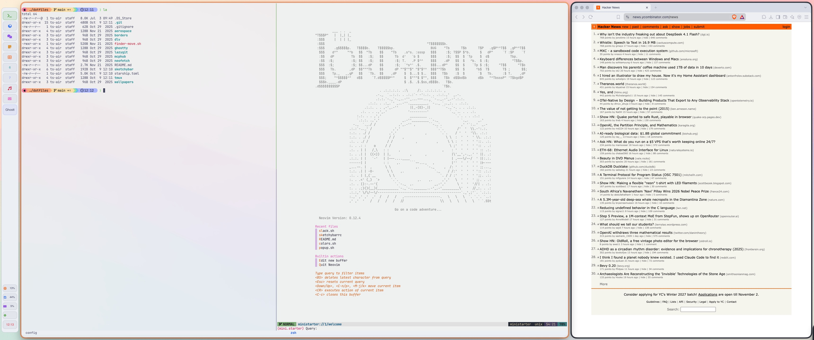

# dotfiles

Personal macOS dotfiles for a keyboard-driven desktop: AeroSpace tiling, a
SketchyBar left rail, and a Ghostty + tmux terminal workflow. The desktop and
terminal use Catppuccin Latte; the Starship prompt uses Catppuccin Mocha.

## Desktop Preview



The configured desktop with Catppuccin Latte styling, the SketchyBar left rail,
and AeroSpace window tiling.

## What's Included

| Configuration | Purpose |
| --- | --- |
| [AeroSpace](aerospace/aerospace.toml) | Nine persistent workspaces, Vim-style navigation, application routing, and room for the left rail |
| [SketchyBar](sketchybar/) | A 72-pixel Latte rail with workspace tiles, focused app, CPU, disk, memory, Slack status, and a 24-hour clock |
| [Borders](borders/bordersrc) | Rounded, 10-pixel window borders with a peach focus highlight |
| [Ghostty](ghostty/config) | Latte theme, translucent background, Fira Code Nerd Font, and leader-key tab/split controls |
| [tmux](tmux/tmux.conf) | Mouse support, vi copy mode, 33% splits, Vim navigation, and a Latte dotbar |
| [Starship](starship.toml) | Powerline-style prompt with directory, Git, language/environment modules, time, and command duration |

The repository also includes [Neofetch settings](neofetch/config.conf),
[Delve settings](dlv/config.yml), [wallpapers](wallpapers/), and a
[Finder helper](finder-move.sh). The [Lazygit config](lazygit/config.yml) and
[MCPHub server list](mcphub/servers.json) are currently empty placeholders.
Neovim is maintained separately in [steckoverflow/neovim](https://github.com/steckoverflow/neovim).

## Setup

These are personal configuration files, not an automated installer. Review them
before linking, especially application paths and shortcuts. Back up any existing
configuration at the destinations below; the commands deliberately do not force
replacement.

### 1. Install the Tools

With [Homebrew](https://brew.sh/):

```sh
brew install --cask nikitabobko/tap/aerospace ghostty
brew install FelixKratz/formulae/sketchybar FelixKratz/formulae/borders tmux starship
brew install --cask font-fira-code-nerd-font font-hack-nerd-font
```

Use an AeroSpace version supporting `config-version = 2` and
`persistent-workspaces`, and a SketchyBar version supporting `position=left`
(the rail is documented against SketchyBar 2.24.0). Grant macOS Accessibility
permissions when prompted by the window-management tools.

Ghostty requests `FiraCodeNerdFont`; SketchyBar uses `Hack Nerd Font` for icons
and `SF Pro` for labels. If text or icons fall back, check the installed font
family names and adjust the corresponding config.

### 2. Clone and Link

```sh
mkdir -p "$HOME/.config"
git clone https://github.com/steckoverflow/dotfiles.git "$HOME/.config/dotfiles"

for config in aerospace borders ghostty sketchybar tmux; do
  ln -s "$HOME/.config/dotfiles/$config" "$HOME/.config/$config"
done
ln -s "$HOME/.config/dotfiles/starship.toml" "$HOME/.config/starship.toml"
```

If the repository is already cloned, skip `git clone`. Optional configurations
can be linked individually when needed; they are not required for the desktop.

### 3. Enable the Prompt and tmux Plugins

Add this to your zsh startup configuration, after any other prompt setup:

```sh
eval "$(starship init zsh)"
```

Install [TPM](https://github.com/tmux-plugins/tpm) at the path expected by tmux:

```sh
mkdir -p "$HOME/.config/tmux/plugins"
git clone https://github.com/tmux-plugins/tpm "$HOME/.config/tmux/plugins/tpm"
tmux
```

Inside tmux, press `Ctrl+b`, then `Shift+i` to install `vim-tmux-navigator` and
`tmux-dotbar`. Plugin checkouts are ignored by Git and are not shipped here.
Navigation between tmux and Neovim also needs the corresponding editor plugin.

### 4. Start the Desktop

```sh
brew services start borders
open -a AeroSpace
```

AeroSpace starts SketchyBar and sends workspace-change events to it. Avoid
starting a second SketchyBar instance through a separate service. AeroSpace's
`start-at-login` is currently `false`; enable it in the config if desired.
Ensure `sketchybar` is available on AeroSpace's `PATH`.

## Keybindings

### AeroSpace

`Alt` means the macOS Option key. Directional keys follow Vim: `h` left, `j`
down, `k` up, `l` right.

| Keys | Action |
| --- | --- |
| `Alt+h/j/k/l` | Focus a window |
| `Alt+Shift+h/j/k/l` | Move a window |
| `Alt+1` through `Alt+9` | Switch workspace |
| `Alt+Shift+1` through `Alt+Shift+9` | Send window to workspace without following it |
| `Alt+Tab` | Switch back to the previous workspace |
| `Alt+Shift+Tab` | Move the current workspace to the next monitor |
| `Alt+-` / `Alt+=` | Shrink / grow the focused window |
| `Alt+/` / `Alt+,` | Cycle tile / accordion orientation |
| `Alt+v` | Toggle fullscreen |
| `Alt+f` / `Alt+g` / `Alt+s` | Launch Firefox Developer Edition / Ghostty / Slack |
| `Alt+e` or `Alt+Shift+;` | Enter service mode |
| `Alt+c` | **Close all windows except the focused one** |

In service mode, `Esc` reloads the config and returns to normal bindings, `r`
resets the layout, and `f` toggles floating/tiling. `Alt+e` exits service mode.
`Alt+Shift+h/j/k/l` joins a neighboring container; the up/down arrows control
volume, and `Shift+Down` mutes it. `Backspace` closes all other windows.

New Ghostty windows go to workspace **1**, Notes to **4**, Spotify to **8**, and
Signal to **9**. Finder, Reminders, and Slack Huddle windows float. Browser and
chat icons on workspaces 2 and 3 are visual labels, not automatic routing rules.
Launchers assume apps are installed in `/Applications`.

### Ghostty

Press `Cmd+s`, release it, then press the key below. This is a key sequence,
not a simultaneous chord.

| Next Key | Action |
| --- | --- |
| `n` / `c` | New window / tab |
| `r` | Reload configuration |
| `Shift+h` / `Shift+l` | Previous / next tab |
| `,` / `.` | Move tab left / right |
| `1` through `9` | Select tab |
| `\` / `-` | Split right / down |
| `h/j/k/l` | Focus a split |
| `z` / `e` | Zoom / equalize splits |

### tmux

The prefix is `Ctrl+b`; release it before pressing the next key.

| Next Key | Action |
| --- | --- |
| `t` / `Shift+r` | Split right / down, giving the new pane 33% |
| `h/j/k/l` | Focus a pane |
| `Shift+n` | Create a named session |
| `r` | Reload `~/.config/tmux/tmux.conf` |
| `[` | Enter copy mode; use `v` to select and `y` to copy |

Pane and window indexes start at 1, and windows renumber when closed. With
`vim-tmux-navigator` installed, `Ctrl+h/j/k/l` navigates without the prefix.

## Customization

- **Rail:** edit [SketchyBar colors](sketchybar/colors.sh), workspace icons in [sketchybarrc](sketchybar/sketchybarrc), and accents in [the workspace plugin](sketchybar/plugins/aerospace.sh). Click a workspace tile to switch; hover over tiles for details. See the [rail README](sketchybar/README.md) for layout notes.
- **Window spacing:** AeroSpace reserves 90 pixels on the left for the 72-pixel rail and its margin. Keep at least 84 pixels when changing gaps.
- **Terminal:** adjust font, opacity, and theme in [Ghostty's config](ghostty/config). The bundled `cyberdream` theme is an alternative, not the active theme.
- **Prompt:** change `palette` in [starship.toml](starship.toml). All four Catppuccin palettes are defined; Mocha is selected by default.
- **tmux bar:** change the `@tmux-dotbar-*` settings in [tmux.conf](tmux/tmux.conf).

After editing, use `aerospace reload-config` or `sketchybar --reload` as needed.
Ghostty and tmux have reload shortcuts listed above. Battery and volume plugin
scripts exist, but are not enabled in the current rail. The Finder helper is
also not bound to a shortcut by default.
